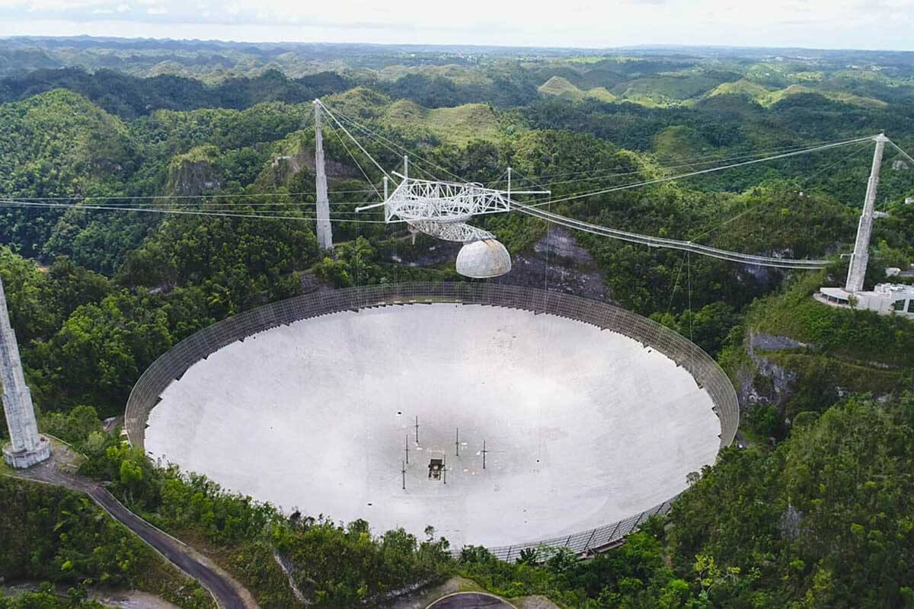
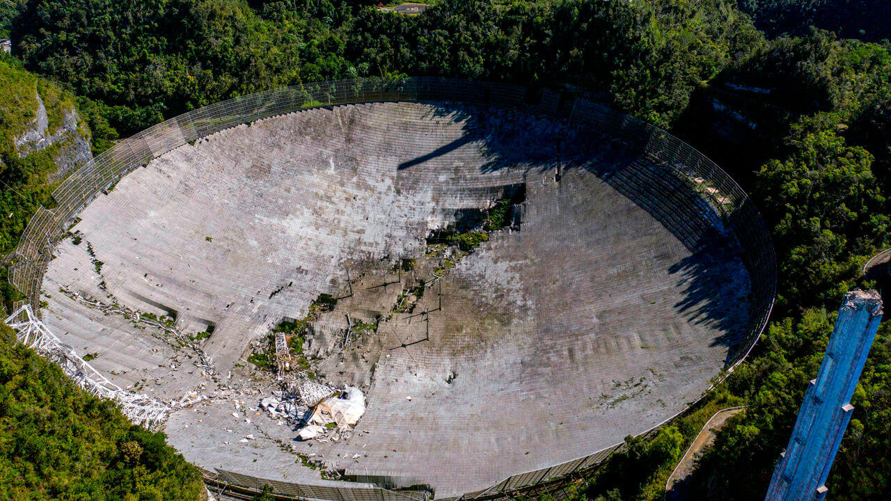

# ⚙️ О продукте

Инженерный конструктор Copter4Space предназначен для приема, декодирования, регистрации и обработки цифровой информации, передаваемой с борта ИСЗ (искусственный спутник Земли) по радиоканалам L-диапазона частот. Комплекс обеспечивает прием изображений со спутников, которые поднимаются над горизонтом выше 60⁰ и автоматическую запись данных на микрокомпьютер комплекса.

<figure><figcaption></figcaption></figure>

### Актуальность конструктора

В далёком 1963 году в 15 километрах от маленького городка Аресибо была открыта одноимённая радиообсерватория. В 1974 году именно оттуда было отправлено легендарное «Послание Аресибо», адресованное внеземным цивилизациям. Помимо этого, данная радиоастрономическая обсерватория принимала активное участие в изучении дальнего космоса. В 2020 году из-за того, что конструкция износилась, лопнул один из тросов, удерживающих облучатель, что повлекло за собой разрушение не только облучателя, но и, частично, «зеркала» приёмного комплекса. На восстановление комплекса уйдут годы и миллионы долларов, поэтому Корнеллский университет и Научный фонд США – главные операторы обсерватории, – сочли нецелесообразным восстановление объекта. Кто знает, может быть, США могли бы совершить ещё не одно открытие в области изучения космоса.

<figure><figcaption></figcaption></figure>

<figure><figcaption></figcaption></figure>

Но давайте немного отыграем ситуацию назад. А что если вместо программируемой руки-манипулятора или тяжёлой тросово-опорной конструкции для переноса облучателя над фокальной плоскостью комплекса приёма космической информации использовать дрон или же сеть дронов? А если это возможно, то почему бы не создать инженерный конструктор для школьных технологических кружков?

